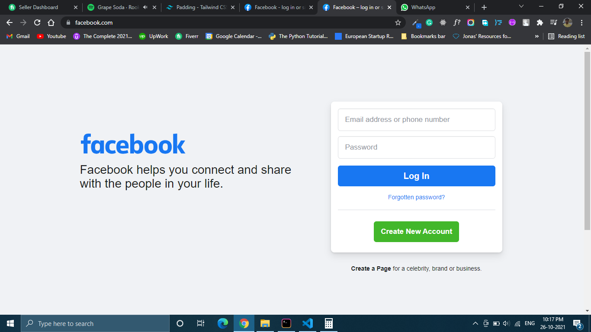
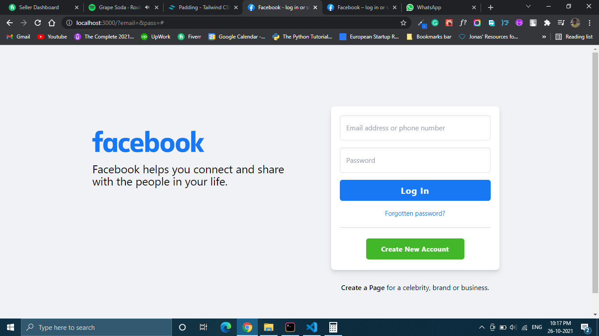

# Facebook Login Page in reactjs using tailwind css

### Start the app
`yarn start`

## Clone
`git clone https://github.com/shubhamku044/facebook-login-page.git`

## Fork
You Can fork it and make same changes to it

## Screenshots

